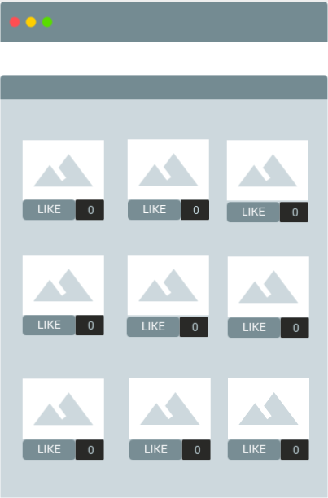

<h2>Instush</h2>

    

<ul>
    <li>
        display at least 10 small pictures as thumbnails
    </li>
    <li>
        make the page responsive by using <code>display: flex</code>. fill the screen width with maximum anount of thumbnails (look at the illustration above - the images fill the browser's screen). the gap between the thumbnails should be constant.
    </li>
    <li>
        below each picture add a "Like" button and a likes counter
    </li>
    <li>
        when the user clicks "Like" - increment the tumbnail's likes counter (use Prototype)
    </li>
    <li>
        add a shadow to the thumbnail whenever the user moves his/her mouse over it
    </li>
    <li>
        when the user clicks on a thumbnail - use a blur effect in order to make all elements blurred (you can use <a href="https://www.w3schools.com/howto/howto_css_blurred_background.asp" target="_blank">this example</a>) and display the selected thumbnail as a large picture in the middle of the screen
    </li>
    <li>
        store all counters in localStorage so that when the user closes the browser and returns - he/she will see the stored counters
    </li>
</ul>