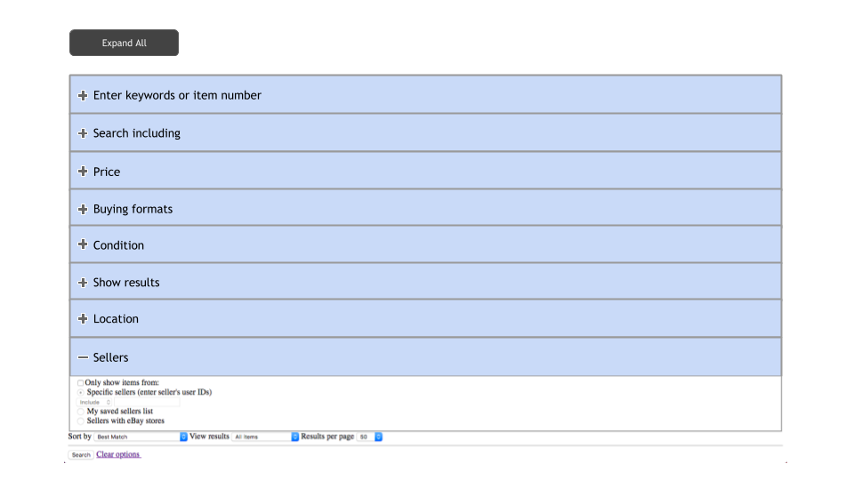

Use <code>group4/Modules/03 Front End Development/Assignments/31</code>

display each section ("Enter keywords or item number", "Search including", "Price" etc.) as a collapsed view.

the collapsed view should contain only the title (without the content).

clicking on the title should open the section content. <a href="https://master-origin-collapsible.fgview.com/demo/index.html#basic" target="_blank">example (do not use the code - only watch how it gets displayed)</a>.

add an "Expand All" button which allows expanding all sections at once.

clicking the "Expand All" button should change its text to "Collapse All" and then clicking on it should do the opposite - collapses all sections.

after collapsing the button should return to its initial state ("Expand All").

Illustration: (all sections are collapsed except from "Sellers" wchich is expanded)

