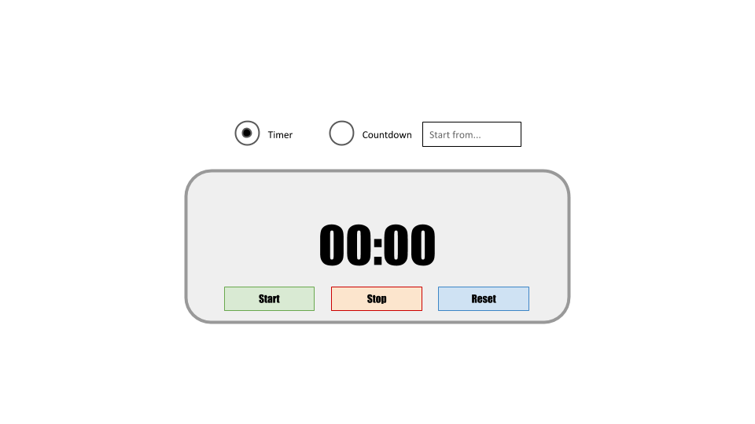

use <b>revealing module pattern</b> in order to create a singleton (a single instance - no further instances) named <code>Counter</code> which contains a parameter named <code>counterType</code>. The parameter can be assigned as "down" or "up".

add methods to the constructor:
<ol>
<li><code>start</code> - starts a <b>timer</b> if <code>counterType</code> is "up" <i>or</i> a countdown if it's "down". countdown should be initialized with a value (for example: counting down from 5 minutes should count the seconds from 05:00 to 00:00)</li>
<li><code>stop</code> - stops the timer/coundown. executing <code>start</code> again should continue from this point</li>
<li><code>reset</code> - stops the timer/coundown and sets it to the time <code>00:00</code></li>
</ol>