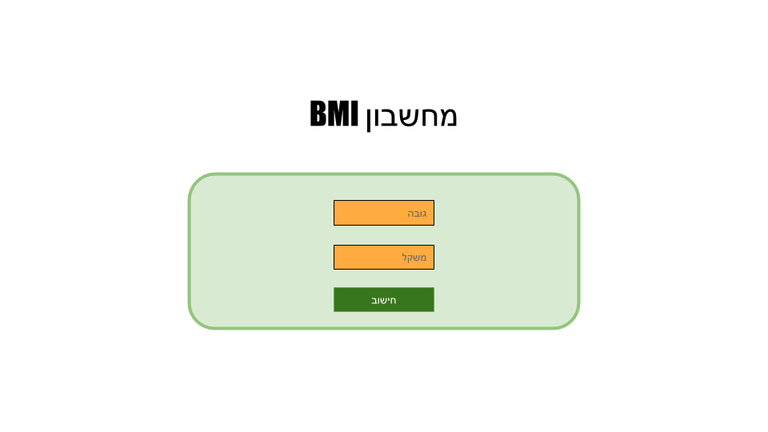
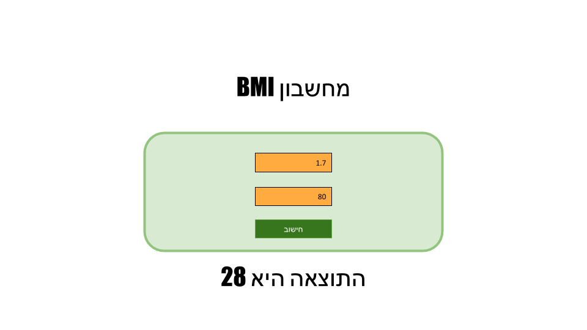

build a BMI calculator.

BMI = weight (kg) /height (meters)2

For example: weight = 80kg. height = 1.7 -> BMI = 28.

add 2 inputs for accepting weight and height.

validate input values and display an error message if anything goes wrong.

add a button for submitting the values.

add a div for displaying the BMI.

<h3>Implementation Details</h3>
<ol>
<li>create a service named <code>BmiCalculator</code> which will be responsible for the calculation as described above.</li>
<li>page should be in hebrew, direction should be right-to-left and text should be aligned to the right.</li>
</ol>
<h3>References</h3>
<ul>
<li><a href="https://steelkiwi.com/blog/right-left-development-tips-and-tricks/" target="_blank">https://steelkiwi.com/blog/right-left-development-tips-and-tricks/</a></li>
<li><a href="https://howtodoinjava.com/angular/angular2-service/" target="_blank">https://howtodoinjava.com/angular/angular2-service/</a></li>
</ul>
<h3>Mock-ups</h3>

