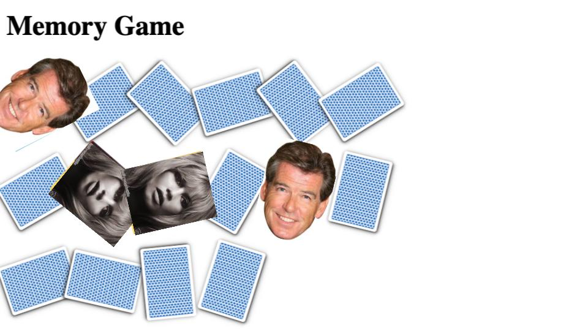

use <code>group4/Modules/06 Angular/Examples/ng-memory-game</code>.

create a node server which accepts search keywords as a querystring.

the server should request Google Images for search results for the specified keywords.

use the first 8 pictures from the results as the card content in the memory game.

<h2>Example</h2>
<h4>after sending to the server the keywords "movie star face close up":</h4>

<h2>npm modules</h2>

execute requests using the <a href="https://www.npmjs.com/package/request" target="_blank">request</a> npm module. Install it by running <code>npm init -y</code> and <code>npm install request</code>.

read from querystring using the <a href="https://www.npmjs.com/package/query-string" target="_blank">query-string</a> npm module. Installation: <code>npm install query-string</code>.
