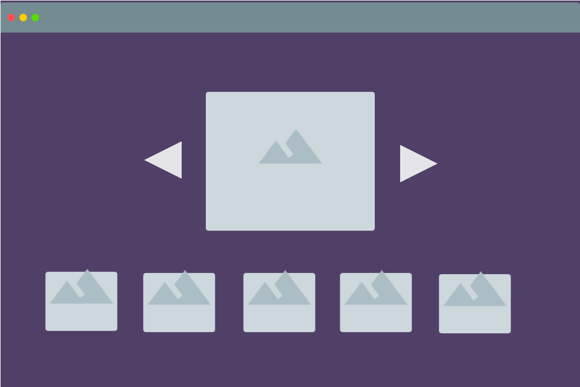

<h2>Gallery</h2>

    

<ol>
    <li>
        display one large picture in the middle
    </li>
    <li>
        display at least 10 small pictures as thumbnails below the large picture
    </li>
    <li>
        when the user clicks on the left or right arrows - display the previous/next picture accordingly
    </li>
    <li>
        when the user clicks on a thumbnail - replace the picture in the middle with the selected one
    </li>
    <li>
        store the current large picture in localStorage so that when the user closes the browser and returns - he/she will see the stored picture
    </li>
    <li>
        <b>bonus:</b> add arrows on both sides of the thumbnails row. when the user moves his/her mouse over an arrow - the row should slide left/right and display more thumbnails
    </li>
</ol>